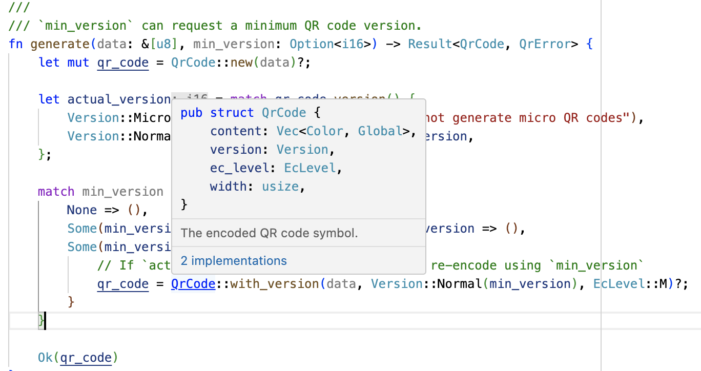

# Visual Studio Code

Types are elided in Rust code, which makes a good IDE even more useful than for
C++. Visual Studio code works well for Rust in Chromium. To use it,

- Ensure your VSCode has the `rust-analyzer` extension, not earlier forms of
  Rust support
- `gn gen out/Debug --export-rust-project` (or equivalent for your output
  directory)
- `ln -s out/Debug/rust-project.json rust-project.json`

A demo of some of the code annotation and exploration features of rust-analyzer
might be beneficial if the audience are naturally skeptical of IDEs.

The following steps may help with the demo (but feel free to instead use a piece
of Chromium-related Rust that you are most familiar with):

- Open `components/qr_code_generator/qr_code_generator_ffi_glue.rs`
- Place the cursor over the `QrCode::new` call (around line 26) in
  `qr_code_generator_ffi_glue.rs
- Demo **show documentation** (typical bindings: vscode = ctrl k i; vim/CoC =
  K).
- Demo **go to definition** (typical bindings: vscode = F12; vim/CoC = g d).
  (This will take you to `//third_party/rust/.../qr_code-.../src/lib.rs`.)
- Demo **outline** and navigate to the `QrCode::with_bits` method (around line
  164; the outline is in the file explorer pane in vscode; typical vim/CoC
  bindings = space o)
- Demo **type annotations** (there are quote a few nice examples in the
  `QrCode::with_bits` method)

It may be worth pointing out that `gn gen ... --export-rust-project` will need
to be rerun after editing `BUILD.gn` files (which we will do a few times
throughout the exercises in this session).

