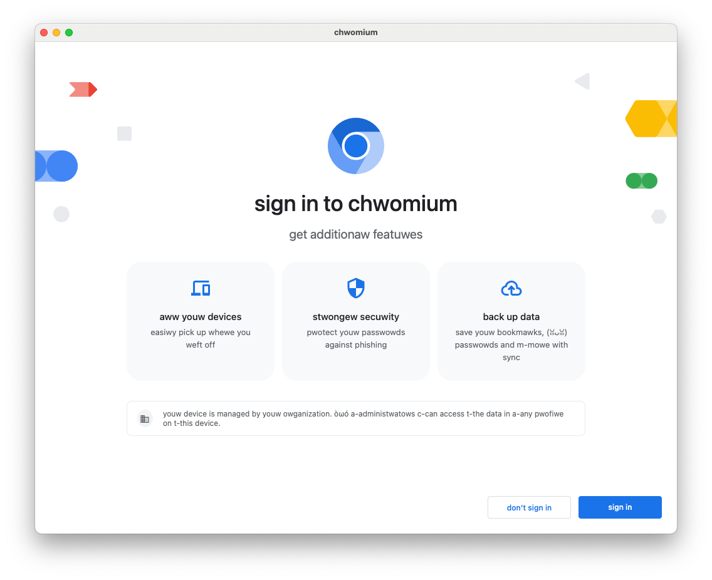

# Bringing It Together --- Exercise

In this exercise, you're going to add a whole new Chromium feature, bringing
together everything you already learned.

## The Brief from Product Management

A community of pixies has been discovered living in a remote rainforest. It's
important that we get Chromium for Pixies delivered to them as soon as possible.

The requirement is to translate all Chromium's UI strings into Pixie language.

There's not time to wait for proper translations, but fortunately pixie language
is very close to English, and it turns out there's a Rust crate which does the
translation.

In fact, you already [imported that crate in the previous exercise][0].

(Obviously, real translations of Chrome require incredible care and diligence.
Don't ship this!)

## Steps

Modify `ResourceBundle::MaybeMangleLocalizedString` so that it uwuifies all
strings before display. In this special build of Chromium, it should always do
this irrespective of the setting of `mangle_localized_strings_`.

If you've done everything right across all these exercises, congratulations, you
should have created Chrome for pixies!

Students will likely need some hints here. Hints include:

- UTF16 vs UTF8. Students should be aware that Rust strings are always UTF8, and
  will probably decide that it's better to do the conversion on the C++ side
  using `base::UTF16ToUTF8` and back again.
- If students decide to do the conversion on the Rust side, they'll need to
  consider [`String::from_utf16`][1], consider error handling, and consider
  which [CXX supported types can transfer a lot of u16s][2].
- Students may design the C++/Rust boundary in several different ways, e.g.
  taking and returning strings by value, or taking a mutable reference to a
  string. If a mutable reference is used, CXX will likely tell the student that
  they need to use [`Pin`][3]. You may need to explain what `Pin` does, and then
  explain why CXX needs it for mutable references to C++ data: the answer is
  that C++ data can't be moved around like Rust data, because it may contain
  self-referential pointers.
- The C++ target containing `ResourceBundle::MaybeMangleLocalizedString` will
  need to depend on a `rust_static_library` target. The student probably already
  did this.
- The `rust_static_library` target will need to depend on
  `//third_party/rust/uwuify/v0_2:lib`.

[0]: https://crates.io/crates/uwuify
[1]: https://doc.rust-lang.org/std/string/struct.String.html#method.from_utf16
[2]: https://cxx.rs/binding/slice.html
[3]: https://doc.rust-lang.org/std/pin/
