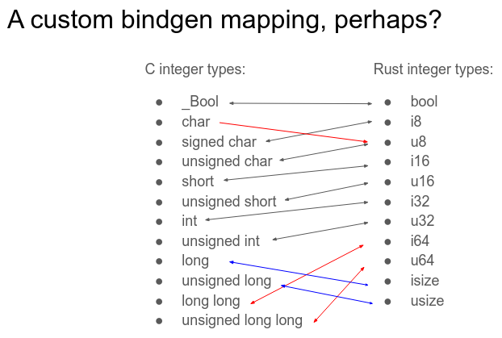

# Type Mapping

The kernel uses slightly different conventions for its types than other C code.
As such, the normal use of `bindgen` to generate bindings can introduce some problems when applied to the kernel.

The explicit `{u,s}{8,16,32,64}` types map in the obvious way to Rust `{u,i}{8,16,32,64}` types,
but the potential signedness of `char` as well as
the kernel's requirement that `long`s can hold pointers
introduce some deviations from the expectations of C as implemented by bindgen.

As such, an alternative bindgen mapping is used for the kernel[^1]:

[^1]: <https://lwn.net/Articles/993163/>
